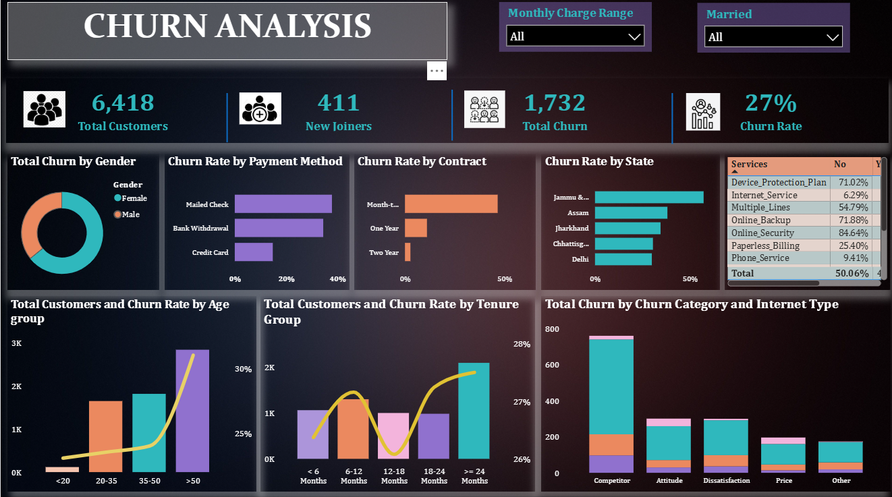

# Customer Churn Analysis

## 📌 Project Overview

This project analyzes customer churn to identify the key factors influencing customer retention, revenue, and customer behavior. The analysis uses **SQL for data cleaning and exploration** and **Power BI for interactive visualization and dashboard development**.

The project focuses on customer demographics, contract types, payment methods, tenure, geographic distribution, revenue, and customer status to identify patterns associated with churn.

---

## 🎯 Objectives

The main objectives of this project are to:

* Analyze overall customer churn.
* Identify customer segments with higher churn.
* Understand the relationship between **contract type and churn**.
* Analyze churn by **gender and geographic location**.
* Examine **revenue by customer status**.
* Investigate payment methods and service categories associated with churn.
* Identify missing/null values in the dataset.
* Build an interactive **Power BI Customer Churn Dashboard**.
* Provide actionable recommendations for improving customer retention.

---

## 📊 Dataset Overview

The dataset contains information about **6,418 customers** and includes customer, demographic, service, contract, payment, and churn-related information.

### Important attributes include:

* Customer ID
* Gender
* Age
* State
* Tenure
* Contract type
* Payment method
* Internet service
* Customer status
* Monthly charges
* Total revenue
* Churn information
* Additional subscribed services

---

## 🛠️ Tools & Technologies

| Tool                       | Purpose                                                 |
| -------------------------- | ------------------------------------------------------- |
| **SQL**                    | Data cleaning, transformation, validation, and analysis |
| **Power BI**               | Dashboard development and data visualization            |
| **Customer Churn Dataset** | Source data                                             |

---

# 🔍 Analysis Process

## 1. Executive Summary

The project analyzes customer churn to understand why customers leave and which customer characteristics are associated with higher churn.

The analysis combines customer demographics, contract information, payment methods, tenure, services, geographic information, and revenue metrics.

SQL was used to prepare and analyze the data, while Power BI was used to present the findings through an interactive dashboard.

---

## 2. Dataset Overview

The dataset consists of **6,418 customer records**.

The data contains information related to:

* Customer demographics
* Geographic location
* Customer tenure
* Contract type
* Payment method
* Internet and additional services
* Customer status
* Revenue
* Churn

---

## 3. Key Components

### Staging Environment

The raw customer data is loaded into a staging environment before being transformed and analyzed.

### SQL Transformation Layer

SQL is used to:

* Clean the dataset
* Transform raw data
* Analyze customer behavior
* Calculate churn metrics
* Analyze revenue
* Identify trends across customer segments
* Validate data quality

### Power BI

The processed data is connected to Power BI to create an interactive dashboard containing key churn and customer metrics.

---

# 🚀 4. Project Workflow

```text
Raw Customer Data
        ↓
Staging Environment
        ↓
Data Cleaning & Validation
        ↓
SQL Transformation
        ↓
SQL Analysis
        ↓
Churn & Revenue Metrics
        ↓
Power BI
        ↓
Interactive Customer Churn Dashboard
        ↓
Insights & Recommendations
```

---

# 📁 5. Project Structure

```text
Customer-Churn-Analysis/
│
├──Dataset/
|     └──Churn_Analysis_Customer_Data.csv
│
├── SQL/
│   ├── CustomerChurnBasicQuery.sql
│   ├── NullVlaueCheckQuery.sql
│   └── ReplaceNullValueQuery.sql
│
├── PowerBI/
│   └── Customer_Churn_Analysis.pbix
|
├── Word Document/
|   └── Customer_Churn_Analysis.docx
|
├── PDF/
|   └── Customer_Churn_Analysis.pdf
|
└── README.md/
    
    

```

---

# 📈 6. Core Metrics & SQL Analysis

## A. Overall Churn Analysis

The analysis calculates the overall number and percentage of customers who have churned.

The Power BI dashboard reports:

* **Total Customers:** 6,418
* **Churned Customers:** 1,732
* **Churn Rate:** 27%

These metrics provide a high-level overview of the customer retention situation.

---

## B. Customer Status Distribution

Customers are analyzed according to their current status, allowing comparison between different customer groups.

This helps understand:

* Active customers
* Churned customers
* Customer revenue contribution
* Differences in customer behavior

---

## C. Churn by Gender

SQL is used to calculate customer churn across gender categories.

This analysis helps determine whether churn patterns differ between customer groups.

---

## D. Churn Based on Contract

Customers are grouped according to their contract type.

The analysis examines whether customers with different contract structures have different churn patterns.

Contract categories can include:

* Month-to-month
* One-year contracts
* Two-year contracts

This provides insight into the relationship between contract commitment and customer retention.

---

## E. Total Revenue by Customer Status

Revenue is grouped by customer status to understand how different customer groups contribute to overall revenue.

This analysis helps connect **customer churn with potential revenue impact**.

---

## F. Churn by State

Customer churn is analyzed geographically by state.

This allows the project to identify geographical variations in churn and determine whether certain locations have noticeably different customer retention patterns.

---

## G. SQL Query Analysis

SQL queries were developed to perform the required calculations and transformations.

The SQL analysis covers:

* Customer counts
* Churn calculations
* Revenue calculations
* Churn by gender
* Churn by contract
* Churn by state
* Customer status analysis
* Data validation
* Missing/null-value analysis

---

## H. Data Quality & Null Value Analysis

The dataset was also examined for missing or null values.

This step is important because missing values can affect:

* Churn calculations
* Revenue analysis
* Customer segmentation
* Power BI visualizations

The analysis helps ensure that the dataset is appropriately prepared before creating the final dashboard.

---

# 📊 7. Power BI Dashboard

The processed SQL data was connected to Power BI to create an interactive **Customer Churn Analysis Dashboard**.

### Dashboard KPIs

The dashboard highlights key metrics such as:

* Total Customers — **6,418**
* New/other customer metrics
* Churned Customers — **1,732**
* Churn Rate — **27%**

### Dashboard Visualizations

The dashboard includes visual analysis of:

* Customer churn
* Churn by contract
* Churn by payment method
* Churn by state
* Customer demographics
* Revenue
* Customer status
* Other service and customer characteristics

The dashboard provides an interactive way to explore customer churn patterns and identify segments requiring further attention.




---

# 💡 8. Key Takeaways

Based on the SQL analysis and Power BI dashboard:

### Geographic Concentration

Churn varies across states, indicating differences in customer behavior and retention across geographic regions.

### Contract Type

Contract structure is an important dimension for analyzing customer retention. Customers with different contract commitments show different churn patterns.

### Payment Method

Payment methods are analyzed to identify differences in churn between customers using different payment options.

### Customer Tenure

Customer tenure is examined to understand how churn behavior changes throughout the customer lifecycle.

### Revenue Impact

Analyzing revenue by customer status helps connect customer churn with its potential financial impact.

### Customer Services

Internet services and additional services are explored to understand whether service combinations are associated with different churn patterns.

---

# 💼 9. Recommendations

Based on the analysis, the following areas can be considered for customer-retention initiatives:

### 1. Reduce Month-to-Month Contract Churn

Encourage customers on month-to-month contracts to move toward longer-term plans through targeted offers, discounts, or loyalty benefits.

### 2. Develop Customer Win-Back Strategies

Customers who have churned can be analyzed to identify common reasons for leaving. Targeted win-back campaigns can then be developed for appropriate customer segments.

### 3. Improve Service Experience

Where the analysis identifies higher churn among particular service categories, customer feedback and service-quality data can be investigated to identify potential improvement opportunities.

### 4. Promote Convenient Payment Options

Customers using payment methods associated with higher churn can be encouraged to adopt convenient automatic payment options through appropriate incentives or simplified enrollment.

### 5. Monitor High-Churn Geographic Segments

States or regions showing higher churn can be monitored separately to determine whether local customer-service, pricing, or service-related factors require further investigation.

---


# 📌 10. Conclusion

This **Customer Churn Analysis** project demonstrates how SQL and Power BI can be combined to transform raw customer data into meaningful business insights.

The analysis covers customer demographics, contract types, payment methods, geography, tenure, revenue, customer status, and churn. SQL provides the foundation for data preparation and analysis, while Power BI makes the results easier to explore through interactive visualizations.

The project ultimately provides a structured approach for understanding **customer churn, identifying relevant customer segments, and supporting data-driven customer-retention initiatives**.


---

## 👤 Author & Contact
Author: Shefali L

GitHub: @Shefali-L

